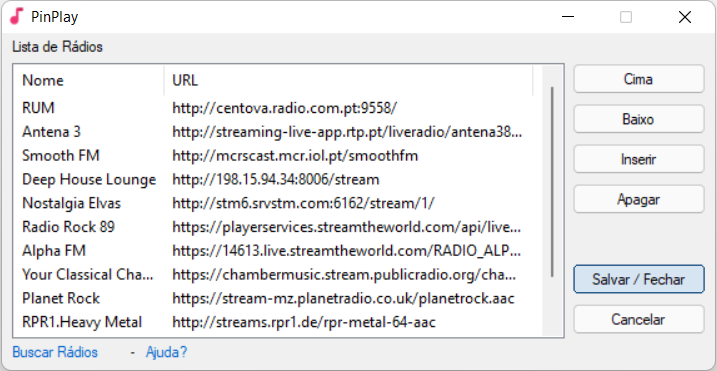

# PinPlay  - Rádio de Internet

PinPlay é um pequeno aplicativo que permite tocar rádios de internet a partir de um ícone da bandeja de sistema do Windows.

A ideia surgiu de uma extensão do ambiente de desktop Gnome em Linux. Este projeto é uma transição dessa extensão. A extensão original, pode ser encontrada em: https://github.com/hslbck/gnome-shell-extension-radio

#### Compatibilidade: Windows 10; Windows 11.

#### Alterações futuras previstas:

- Correções dos bugs atuais;
- Implementação de biblioteca BASSHLS atualizada em x64 e compilação de aplicativo em x64;
- Utilização de atalhos de mídia;
- Criação de pacote c/instalador;
- Distribuição de PinPlay em modo portátil e c/instalador;
- Opção de tocar ao iniciar aplicativo;
- Animação do ícone do Tray;
- Implementação de idiomas;
- Atualização automática de versão.

Nota: No momento, não está contemplada a implementação da busca por rádios diretamente pelo aplicativo.

### Screenshot:

#### Agradecimentos:

- hslbck - Pela ideia da rádio de internet na barra de tarefas - https://github.com/hslbck/gnome-shell-extension-radio
- trancexx - Pela criação do LiveStreaming.au3 - https://www.autoitscript.com/forum/topic/123360-live-streaming/
- wakillon - Pela criação da biblioteca Bass.au3 e BassConstants.au3 - https://www.autoitscript.com/forum/topic/186202-basshls-example-for-play%C2%A0http-live-streaming-streams/
- Melba23 - Pela criação da biblioteca GUIListViewEx.au3 - https://www.autoitscript.com/forum/topic/182492-guilistviewex-new-version-13-sep-21/
- guinness - Pela criação da biblioteca _GUICtrlListView_SaveTxt.au3 - https://www.autoitscript.com/forum/topic/129251-_guictrllistview_savetxt-exports-the-details-of-a-listview-to-a-txt-file/

#### Changelog:

v.1.0.1:

Pequenas correções estéticas.

Bugs:

Ainda é necessário parar e iniciar o PinPlay (Click mouse esquerdo no ícone do tray) na troca de fonte de audio fone/altofalante.
Código de caracteres Unicode não implementado totalmente.

v.1.0:

Correção de bug na alteração de fonte de audio fone/altofalante. Audio consegue resumir sem necessidade de fechar o aplicativo.

Bugs:

Ainda é necessário parar e iniciar o PinPlay (Click mouse esquerdo no ícone do tray) na troca de fonte de audio fone/altofalante.
Código de caracteres Unicode não implementado totalmente.

v.0.9:

Versão inicial (x86)

Bugs:

É necessário fechar e abrir aplicativo na troca de fonte de audio fone/altofalante.
Código de caracteres Unicode não implementado totalmente.
